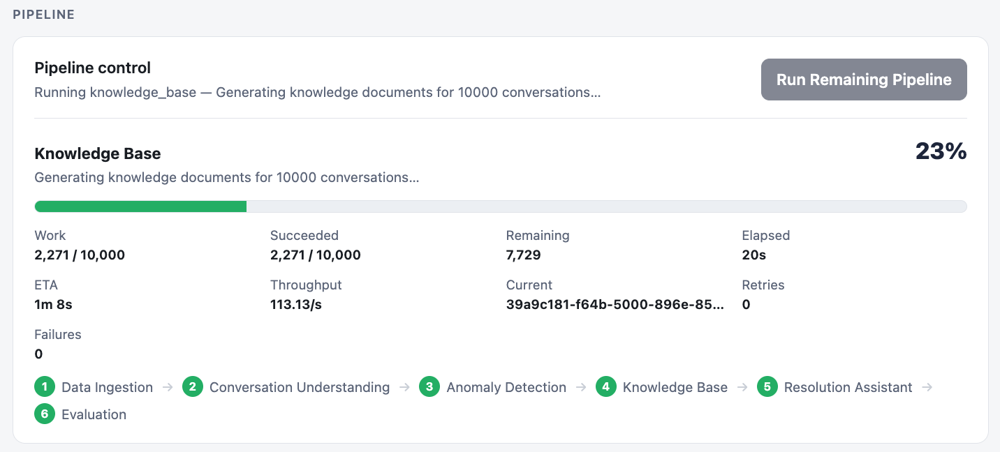
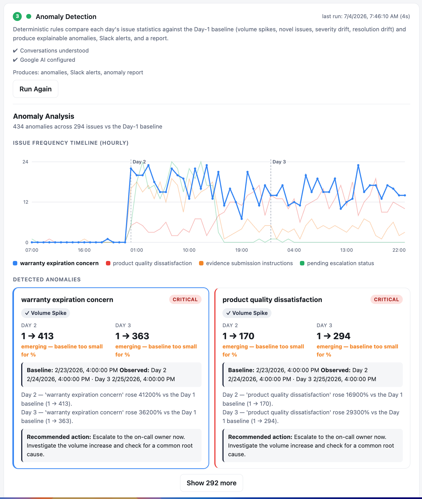
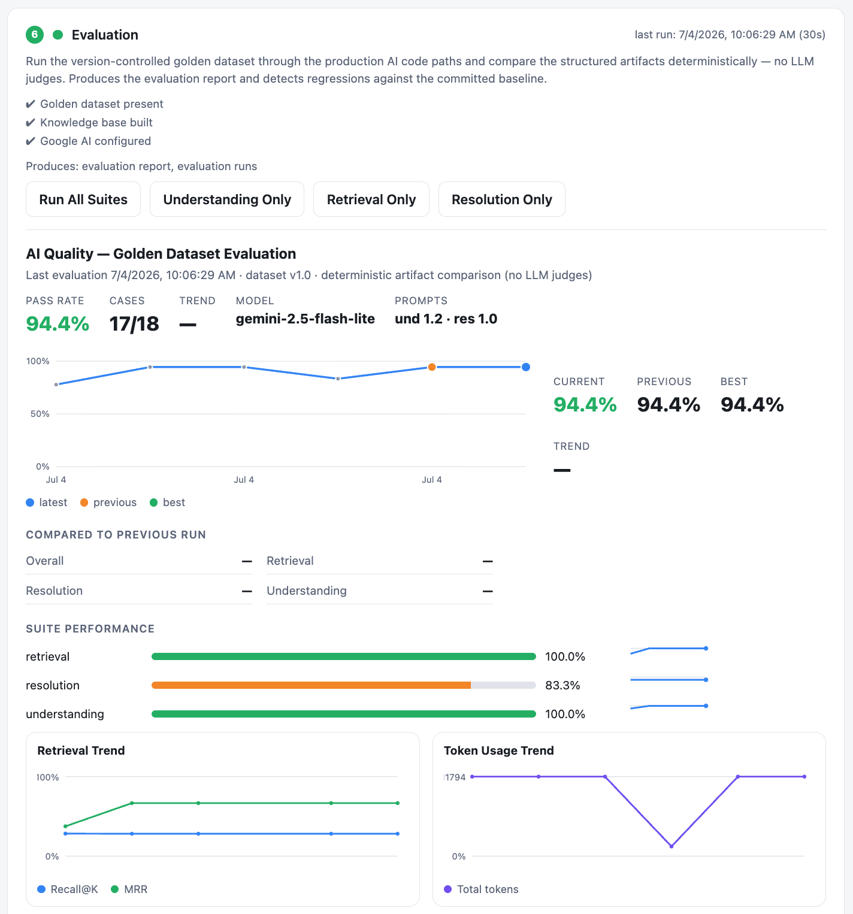
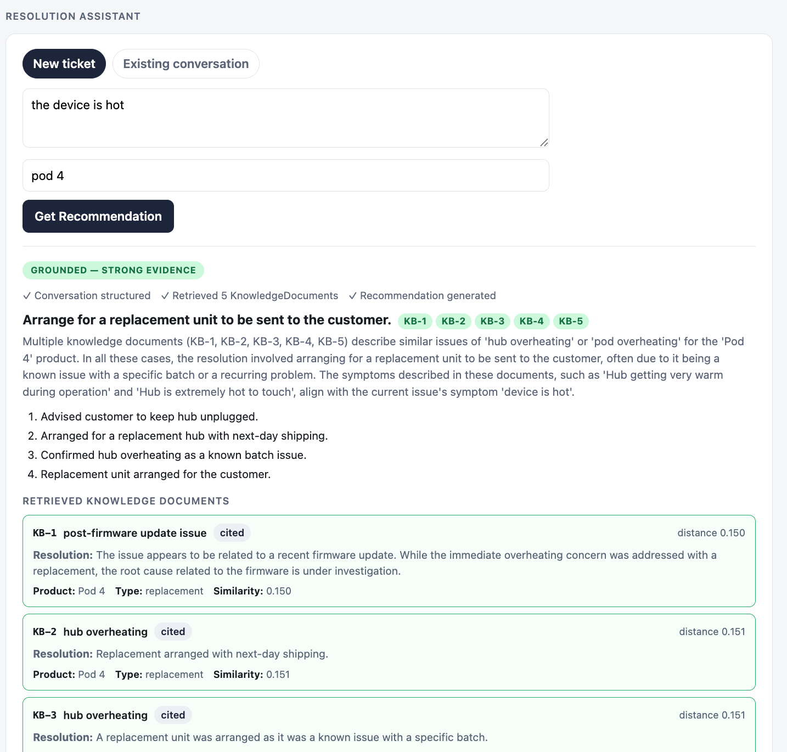

# Conversation Intelligence Platform

### Supporting Documentation

This write-up focuses on the final architecture and engineering outcomes. Detailed implementation decisions are documented separately:

- Architecture Overview: [`ARCHITECTURE.md`](ARCHITECTURE.md)
- Architectural Decision Records (ADRs): [`docs/ARCHITECTURE_DECISIONS.md`](docs/ARCHITECTURE_DECISIONS.md)
- Implementation Roadmap: [`docs/IMPLEMENTATION_PLAN.md`](docs/IMPLEMENTATION_PLAN.md)
- Production Prompt Specifications: [`docs/PROMPT_LIBRARY.md`](docs/PROMPT_LIBRARY.md)

## 1. Problem
Customer support organizations accumulate thousands of conversations, but transforming those conversations into operational intelligence is difficult. Traditional analytics cannot reason over free-form conversations. Purely LLM-driven systems often become opaque pipelines whose outputs are difficult to validate, test, and reuse.

This project demonstrates a production-oriented architecture that performs semantic understanding exactly once. It converts that understanding into strongly typed artifacts and enables reproducible downstream capabilities, including anomaly detection, semantic retrieval, and grounded resolution assistance.

## 2. Overall Architecture

The complete architecture, pipeline descriptions, orchestration model, and technology decisions are documented in [`ARCHITECTURE.md`](ARCHITECTURE.md). Figure 1 shows the overall processing flow.

*Figure 1. High-level architecture of the Conversation Intelligence Platform.*

### Pipeline Overview / System Workflow

The pipeline is orchestrated as a sequence of independently executable stages with enforced dependencies, visible progress, and execution metrics. Figure 2 shows the Control Center view used to run stages, monitor completed and remaining work, inspect throughput and retries, and expose operational status. The UI exercises the same orchestration layer as the CLI, so local operation and automated execution share one control path.

*Figure 2. Pipeline Control Center used to orchestrate every stage, monitor progress, and expose operational status.*

### Architectural Philosophy

The central architectural principle of the platform is to use LLMs only for
semantic reasoning and immediately convert their outputs into strongly typed,
schema-backed artifacts.

Rather than allowing AI-generated text to flow through the system, every major
AI stage produces a schema-validated Pydantic model (for example,
StructuredConversation, KnowledgeDocument, or ResolutionResponse).

Once information has crossed the unstructured-to-structured boundary,
downstream processing becomes conventional software engineering.

Analytics, anomaly detection, knowledge generation, retrieval, orchestration,
and evaluation all operate reproducibly on structured artifacts rather than
invoking additional LLM reasoning.

This approach improves reproducibility, simplifies testing, enables
structured regression evaluation, and keeps AI isolated to the parts of the
system that genuinely require semantic understanding.

### Validation During Development

One interesting observation during development was that the average number of
extracted issues per conversation increased substantially across the dataset
(approximately 1.5 to 2.8 to 3.1 issues per conversation from Day 1 through Day
3). At first this suggested either taxonomy fragmentation or duplicate issue
extraction.

Rather than changing the anomaly detection logic immediately, I validated the
underlying assumptions using deterministic SQL queries against the relational
projections. By comparing conversation counts, issue counts, and distinct
conversation/issue pairs, I confirmed that duplicate issue extraction was
negligible and that the increase reflected the structure of the dataset rather
than a defect in the parser.

This reinforced an important engineering principle used throughout the
project: when AI systems produce surprising results, validate the underlying
data and deterministic pipeline before changing model behavior.

### Taxonomy Quality as a System Property

Reviewing the anomaly output revealed that the quality of anomaly detection is
ultimately constrained by the quality of the operational taxonomy. The
multi-signal rules engine correctly identified statistically significant
changes, but semantically similar customer problems occasionally appeared under
slightly different canonical issue names (for example, variations of
temperature-control or water-leak issues).

Rather than adding increasingly complex anomaly heuristics to compensate, I
kept the detection engine intentionally simple and rules-based. This
reinforced the architectural separation of concerns: anomaly detection should
operate over a stable canonical representation, while improvements to
classification belong upstream in Conversation Understanding.

For a production system, I would evolve this through a dedicated taxonomy
service, embedding-assisted taxonomy matching, and a human approval workflow
before new categories become part of the operational catalog. Strengthening the
canonical representation improves every downstream feature, including anomaly
detection, analytics, and retrieval, without increasing the complexity of the
rules engine.

## 3. Part 1 - Clustering & Anomaly Detection
Conversation Understanding performs the platform's only semantic reasoning. From that point onward, anomaly detection operates entirely over relational projections derived from the canonical Structured Conversation Object.

This separation keeps anomaly detection explainable, reproducible, independently testable, and free from additional LLM variability. It also allows improvements in issue classification to benefit downstream features without increasing detection-engine complexity.

Figure 3 shows the deterministic rules engine comparing each day's issue statistics against the Day-1 baseline. The dashboard makes volume spikes, severity drift, novel issues, and other explainable anomalies visible, and the same anomaly artifacts drive Slack alerts and reports.

*Figure 3. Deterministic anomaly detection comparing each day's issue statistics against the Day-1 baseline.*

### Canonical Issue Classification

One of the primary design challenges was preventing semantically identical
customer problems from fragmenting into many slightly different issue names.

Rather than treating issue extraction as a free-form naming task, the
Conversation Understanding prompt frames the problem as **operational
classification**.

The prompt receives the Day 1 Issue Catalog and classifies each extracted issue
into broad, stable operational categories whenever appropriate while preserving
the customer's original wording separately.

This significantly reduces taxonomy fragmentation and produces issue categories
that are suitable for reporting, anomaly detection, and long-term trend
analysis.

The implementation intentionally delegates canonicalization to the LLM for
Version 1. A dedicated taxonomy service would likely be appropriate for a
larger production deployment but was intentionally deferred to keep the
architecture simple while still preserving a clear evolution path.

Canonical anomalies are also self-contained reporting artifacts. Each anomaly
stores both the observation timestamp and the baseline timestamp directly on
the artifact, allowing reports and timeline visualizations to consume anomaly
data without reconstructing temporal context from the underlying
conversations.

## 4. Evaluation & Observability (Phase 7)

Because every AI stage emits a strongly typed, schema-backed artifact, AI behavior
is evaluated through deterministic checks (ADR-015). `app evaluate` runs a
version-controlled golden dataset ([`evals/golden/`](evals/golden/)) through the production
Understanding, Retrieval, and Resolution code paths. It compares the resulting
artifacts field by field: enum and boolean checks, numeric thresholds,
keyword and citation checks. The process never evaluates free-form prose and
never uses another LLM as a judge.

The run produces a versionable report with prompt and model versions,
per-suite pass rates, retrieval recall, precision@k, MRR, grounding metrics,
citation-validity metrics, and token usage. It also detects regressions
against a committed baseline, so prompt or model changes are regression
testable in CI. Each run is persisted to `evaluation_runs` and surfaced on
the Control Center's Evaluation card. The same phase closed the observability
loop by recording token usage and response-level model version for every LLM
call.

Figure 4 shows the evaluation dashboard used for historical trend tracking, regression detection, versioned prompt evaluation, and artifact comparison across historical runs. The evaluation process intentionally avoids LLM-as-a-judge scoring.

*Figure 4. Deterministic evaluation dashboard tracking retrieval, understanding, and resolution quality across historical runs.*

The evaluation pipeline executes the version-controlled golden dataset through the production Conversation Understanding, Retrieval, and Resolution Assistant code paths. It then compares the resulting artifacts against curated expectations. This allows prompt and model changes to be evaluated using reproducible engineering metrics rather than subjective LLM-based scoring.

## 5. Part 2 - Resolution Assistant
Resolved conversations are transformed into schema-validated KnowledgeDocuments and embedded to form the platform's semantic knowledge base. Incoming customer issues are matched against this historical corpus using metadata filtering followed by semantic retrieval.

The Resolution Assistant consumes only the resulting ContextBundle. By separating retrieval from generation, the assistant focuses exclusively on synthesizing grounded recommendations from historical evidence. It does not search for or reinterpret information.

Figure 5 shows the assistant turning filtered semantic retrieval into a grounded recommendation. Citations, evidence strength, and the retrieved historical records remain visible beside the generated response.

*Figure 5. Retrieval-Augmented Resolution Assistant producing grounded recommendations with supporting historical evidence.*

### Grounded Recommendations

The Resolution Assistant is intentionally grounded in retrieved historical
knowledge rather than the model's general knowledge.

The assistant receives a ContextBundle containing the current issue and the most relevant historical KnowledgeDocuments.

Recommendations are produced only from that evidence and include citations to
the supporting KnowledgeDocuments.

When no sufficiently similar historical resolutions exist, the assistant
explicitly reports that no grounded recommendation can be made rather than
inventing troubleshooting guidance.

### Grounding Enforced in Code

Grounding is a platform guarantee, not a prompt aspiration. The context
builder assigns each retrieved KnowledgeDocument a stable citation id
(`KB-1`, `KB-2`, ... in retrieval rank order). Every LLM response then passes
a deterministic validation step. Citations that do not reference a supplied
document are dropped. A response claiming to be grounded while citing no
retrieved document is downgraded to ungrounded. An ungrounded response cannot
carry recommended actions. When retrieval returns nothing at all, the platform
answers without invoking the LLM. "No evidence" costs no tokens and cannot
hallucinate.

The retrieval query itself is rendered from the selected issue using the same field labels as the embedded `knowledge_text`, so query
and documents occupy the same embedding space. The current issue is taken
verbatim from the Structured Conversation Object; the assistant never
reinterprets conversations (a new free-text ticket is structured once by the
existing Prompt #1 and is not persisted).

Additional implementation details are available in the supporting documentation:

- [`ARCHITECTURE.md`](ARCHITECTURE.md)
- [`docs/ARCHITECTURE_DECISIONS.md`](docs/ARCHITECTURE_DECISIONS.md)
- [`docs/IMPLEMENTATION_PLAN.md`](docs/IMPLEMENTATION_PLAN.md)
- [`docs/PROMPT_LIBRARY.md`](docs/PROMPT_LIBRARY.md)

## 6. Key Engineering Decisions
Rather than reproducing every architectural decision, this write-up highlights the decisions that most influenced the final architecture. The complete rationale, alternatives considered, and tradeoffs are documented in [`docs/ARCHITECTURE_DECISIONS.md`](docs/ARCHITECTURE_DECISIONS.md).

Key decisions include:

- Canonical Structured Conversation Object as the single AI artifact.
- Deterministic relational projections for analytics.
- Multi-signal deterministic anomaly detection.
- Deterministic knowledge synthesis instead of a second LLM pass.
- Grounding enforced in code rather than relying on prompt behavior.
- PostgreSQL + pgvector as a unified operational and vector datastore.
- Deterministic golden-dataset evaluation instead of LLM-as-a-judge.

## 7. Future Improvements

The architecture intentionally leaves several natural extension points that would be appropriate for a production-scale deployment:

- **Dedicated taxonomy service** for embedding-assisted issue canonicalization and human-approved taxonomy evolution.
- **Cross-encoder reranking** to improve retrieval precision after the initial vector search.
- **Human feedback workflows** to capture agent corrections and continuously improve prompts and taxonomy quality.
- **Prompt registry and version management** to support controlled prompt rollout, A/B evaluation, and rollback.
- **Streaming and tool-calling** within the Resolution Assistant to support richer interactive support experiences.
- **Distributed background workers** for higher-throughput pipeline execution on larger datasets.
- **Expanded operational monitoring** covering latency trends, retrieval quality, token usage, and model drift over time.
